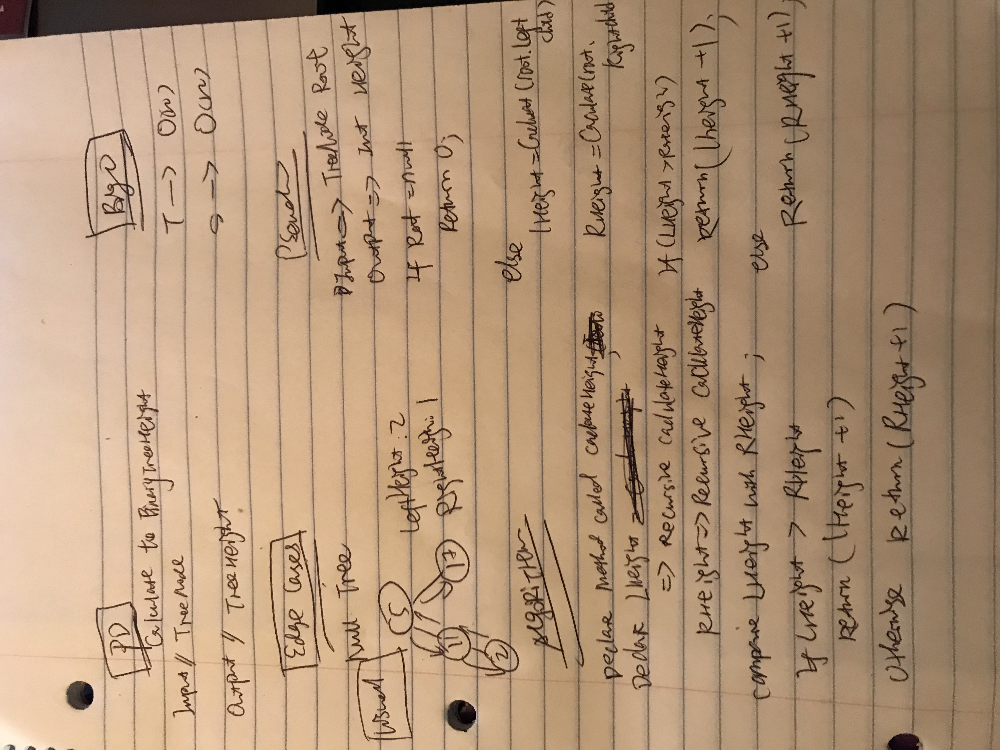

# Chanllenge

Implement a method with the following signature int CalculateBinaryTreeHeight(Node root) that calculates the height of a binary tree.

#Approach and effiency

BigO
T-> O(n)
S->O(n)

#Image

