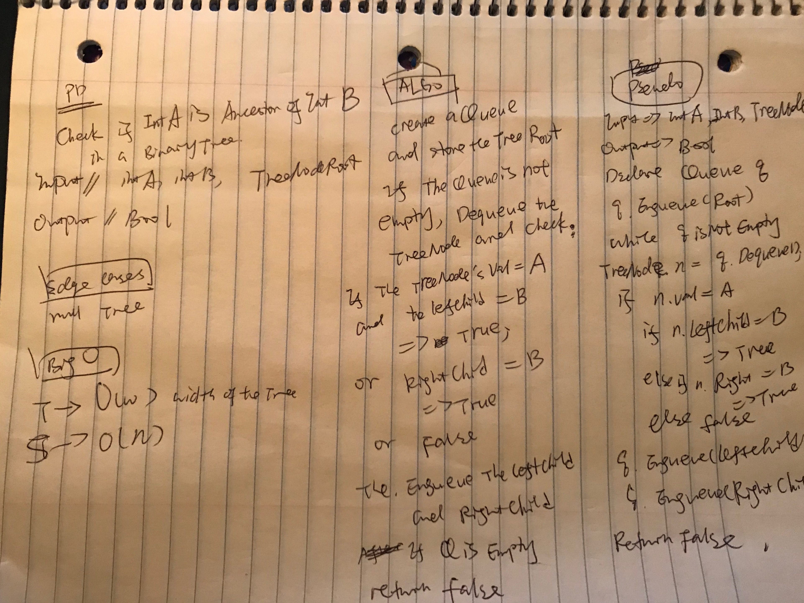

#Check if is Ancestry Relationship

#Challenge

Implement a method with the following signature bool IsAncestor(int A, int B, Node root) that returns true if the value A is an ancestor of the value B in the provided binary tree; the function will return false otherwise.

#Approach and Efficiency
BIGO

T->O(w)
S->O(n)

#Image

