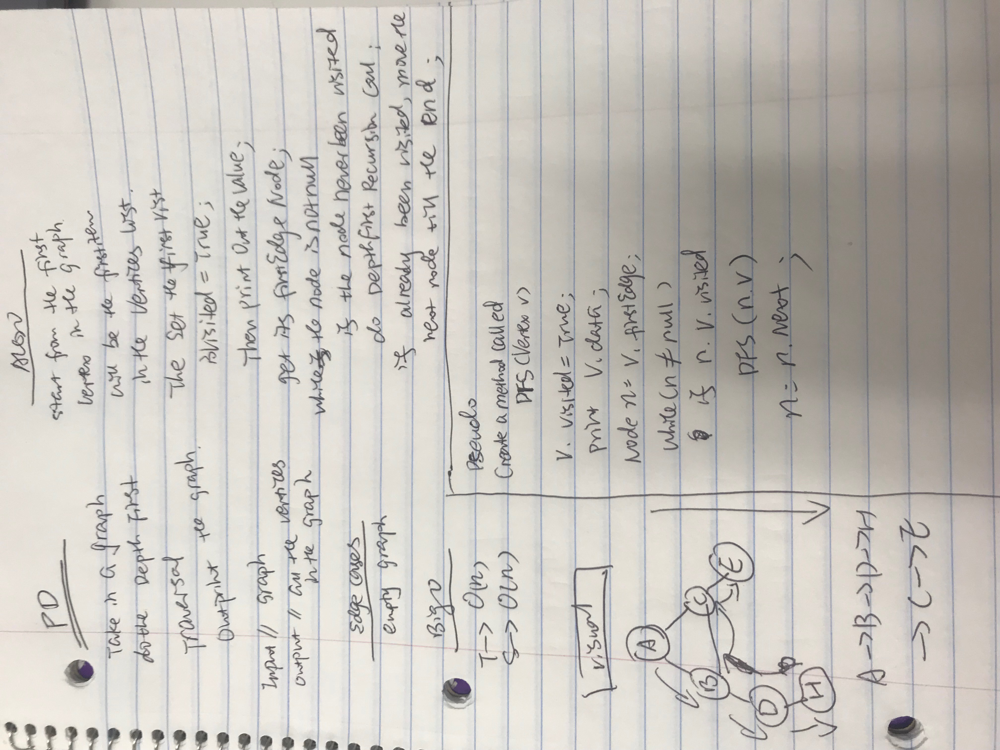

# Depth First Traversal
<!-- Short summary or background information -->
Imaging graph like a tree, take in one Vertex, and bring all the nodes in the graph.
## Challenge
<!-- Description of the challenge -->

Create a function that accepts an adjacency list as a graph, and conducts a depth first traversal. 

Without utilizing any of the built-in methods available to your language,

return a collection of nodes in their pre-order depth-first traversal order.

## Approach & Efficiency
<!-- What approach did you take? Why? What is the Big O space/time for this approach? -->

Approach:
Take in the first Vertex in the graph, and set it visited proptery as True, then outprint its data(value), then get its firstEdge(the node connect to it directly)

node and check if the node is null, and if the vertex connext to it has been visted or not, if already visited, call DFS function else just 

move on to next node and till the end

Effiency:
T->O(n) you have to go through every node in the graph
S->O(H) i am doing recursion so it will be height of call stack

## Solution
<!-- Embedded whiteboard image -->
