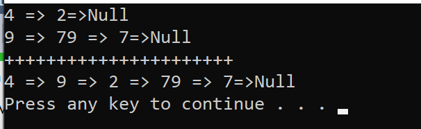
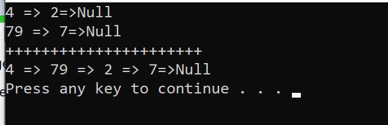

#Merge Two Lists

#Challenge

Write a function called mergeLists

which takes two linked lists as arguments. 

Zip the two linked lists together into one so that the nodes alternate between the two lists and return a reference to the head of the zipped list. Try and keep additional space down to O(1). You have access to the Node class and all the properties on the Linked List class as well as the methods created in previous challenges.

#Proficiency and approch

I created two counters for both lists to determine their length, and then have three different condition : list1 longer, same length
list2 longer.

I also have one temp reference to point to list1.Current.Next; and in the end just print out the list1.

space<-Big o=o(1);
Time<-Big o=o(n);

#whiteboard 

