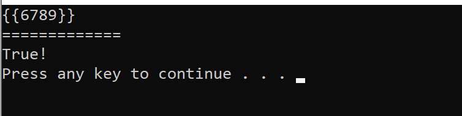
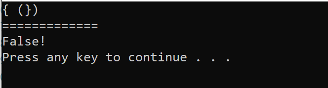
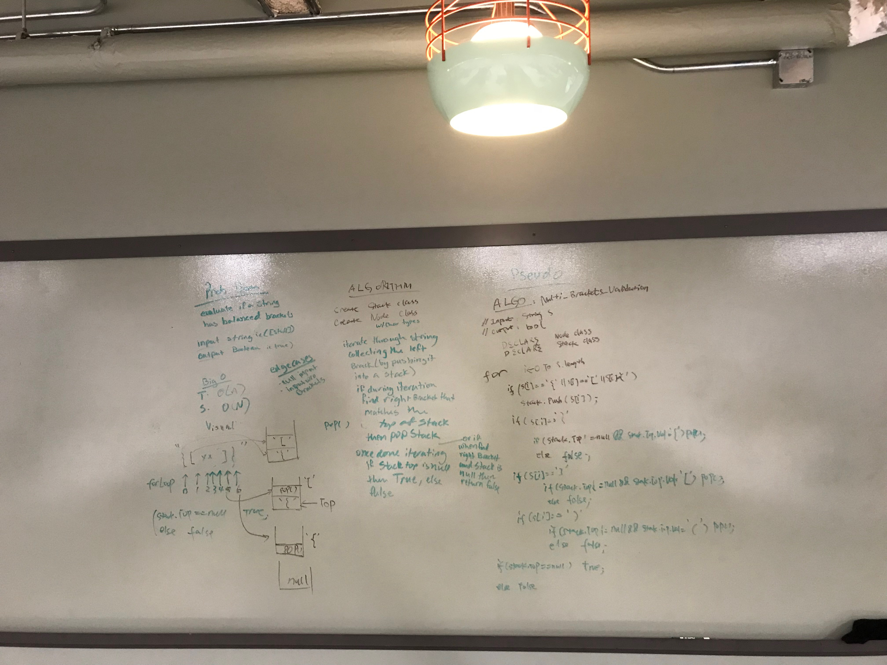

#Multi-bracket-validation

Check if a sting contains validated brackets.

Input	                            Output
{}	                                TRUE

{}(){}	                            TRUE

()[[Extra Characters]]	            TRUE

(){}[[]]	                        TRUE

{}{Code}(())	                    TRUE

[({}]	                            FALSE

(](                             	FALSE

{(})	                            FALSE

## Challenge
<!-- Description of the challenge -->

Your function should take a string as its only argument, and should return a boolean representing whether or not the brackets in the string are balanced. There are 3 types of brackets:

Round Brackets : ()
Square Brackets : []
Curly Brackets : {}

{	FALSE	error unmatched opening { remaining.

)	FALSE	error closing ) arrived without corresponding opening.

[}	FALSE	error closing }. Doesn’t match opening (.

## Approach & Efficiency
<!-- What approach did you take? Why? What is the Big O space/time for this approach? -->

T<-O(n)
S<-O(H)

For example: 

## Solution

