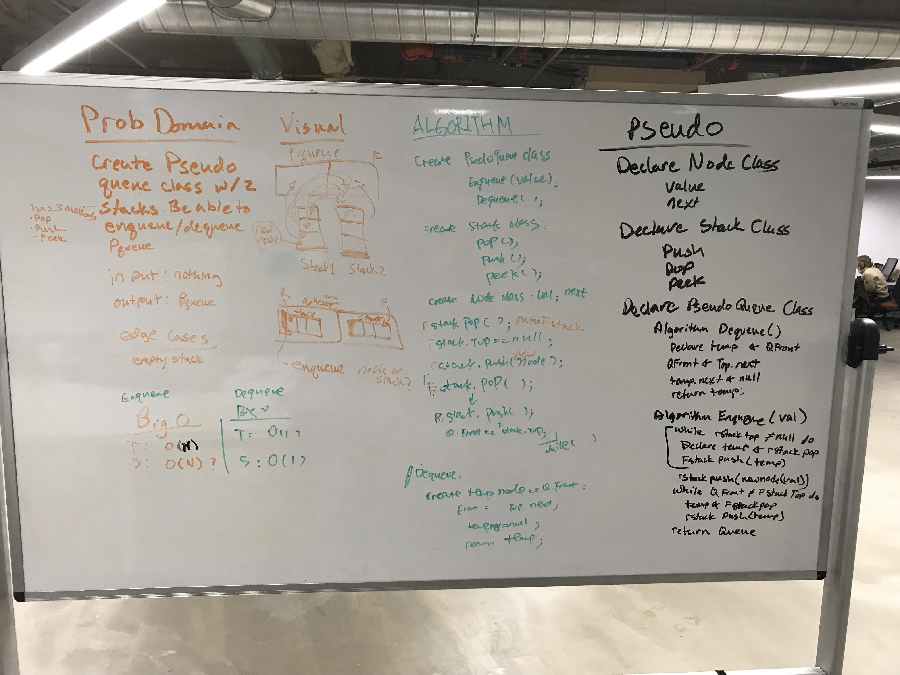

#Queue with Stacks

Queue:FIFO

Stack:FILO

## Challenge
<!-- Description of the challenge -->

Create a brand new PseudoQueue class. PseudoQueue class will implement the standard queue interface, but will internally only utilize 2 Stack objects.

enqueue(value) which inserts value into the PseudoQueue, using a first-in, first-out approach.

dequeue() which extracts a value from the PseudoQueue, using a first-in, first-out approach.

The Stack instances have only push, pop, and peek methods. You should use your own Stack implementation. Instantiate these Stack objects in your PseudoQueue constructor.

## Approach & Efficiency
Enqueue:

T<- O(n)
s<-O(n)

Dequeue:

T<- O(1)
s<-O(1)

## Solution

Following is the whiteboard picture:

