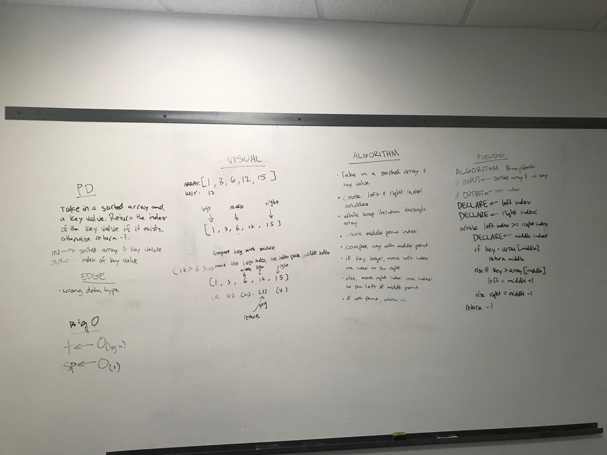

#Binary-search an array

#Challenge
Write a function called BinarySearch which takes in 2 parameters: a sorted array and the search key. 
Return the index of the array’s element that is equal to the search key, or -1 if the element does not exist.

#Whiteboard

