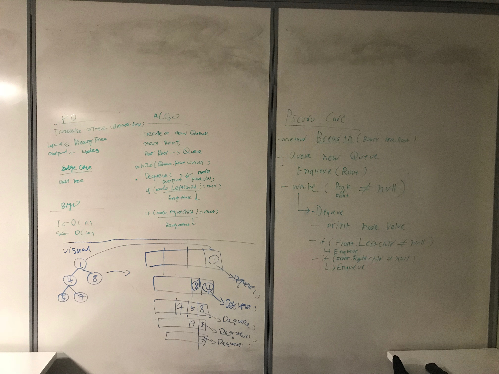

#BreathFirstTraversal Tree

#Challenge

Write a breadth first traversal method which takes a Binary Tree as its unique input.

Without utilizing any of the built-in methods available to your language, traverse the input tree using a Breadth-first approach; print every visited node’s value.

#Approach and Effiency

Big O;

T<-O(n)
S<-O(W)

#WhiteBoard

