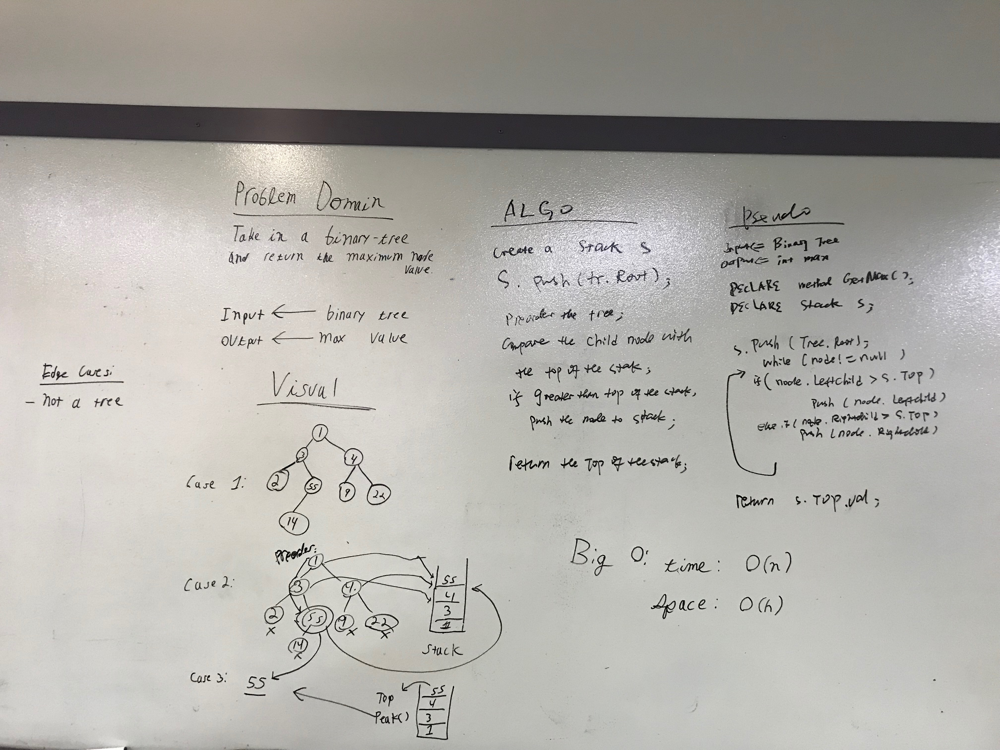
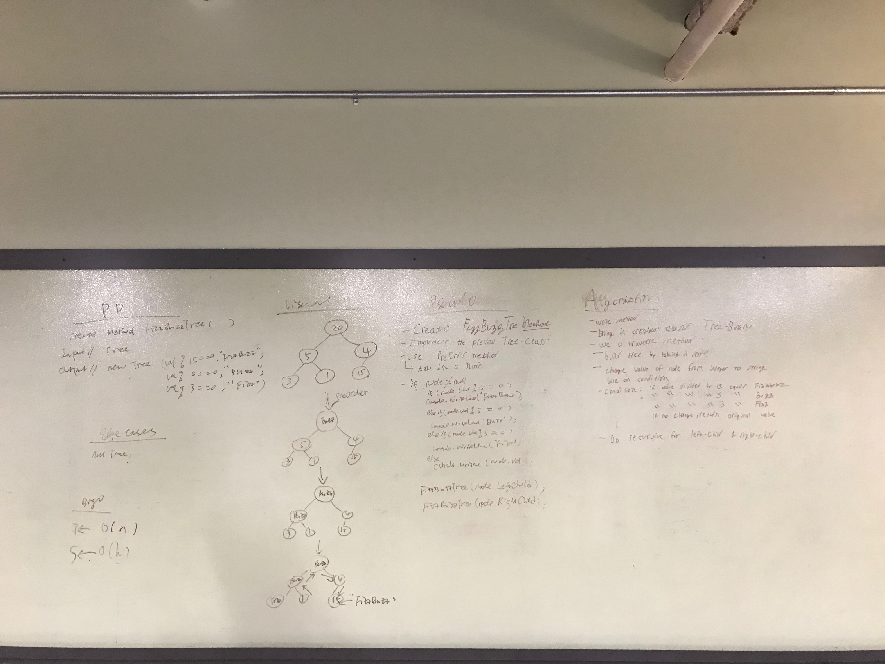

#Find maximun value in a binary tree

Write a function called find-maximum-value which takes binary tree as its only input.
Without utilizing any of the built-in methods available to your language, return the maximum value stored in the tree. 
You can assume that the values stored in the Binary Tree will be numeric.

#Approch and Effiency

Big o

T<- O(n)
S<- O(H)

#whiteboard

