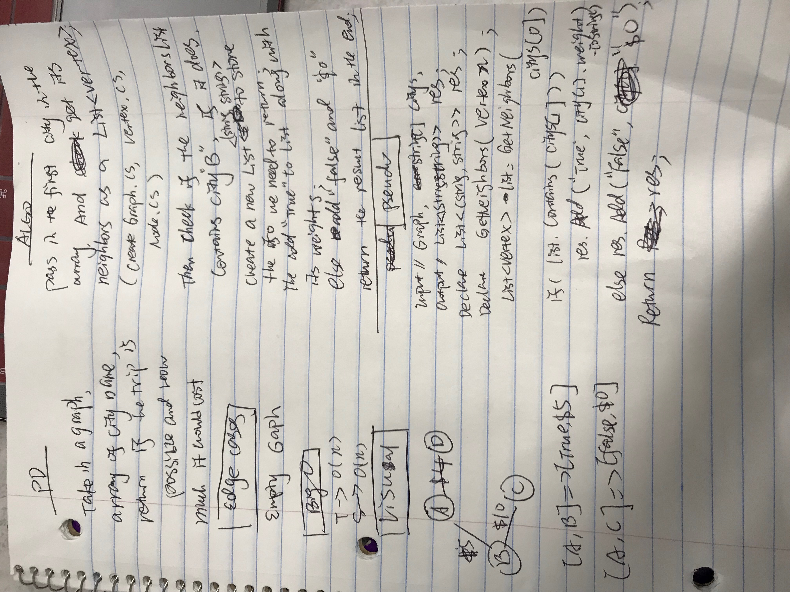

# Find Edges
<!-- Short summary or background information -->

Graph has many nodes, some of them are connect to each other and they have weights some of them are not connected to each other.

## Challenge
<!-- Description of the challenge -->
Write a function based on the specifications above, 

which takes in a graph, 

and an array of city names. Without utilizing any of the built-in methods available to your language, return whether the full trip is possible with direct flights, 

and how much it would cost.

## Approach & Efficiency
<!-- What approach did you take? Why? What is the Big O space/time for this approach? -->

T->O(n);
S->O(n);

## Solution
<!-- Embedded whiteboard image -->

