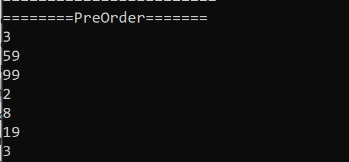

#Tree

Two types of Trees: BinaryTree, BinarySearchTree

BinaryTree:In computer science, a binary tree is a tree data structure in which each node has at most two children, which are referred to as the left child and the right child.

BinarySearchTree: It is a node-based binary tree data structure which has the following properties:
The left subtree of a node contains only nodes with keys lesser than the node’s key.
The right subtree of a node contains only nodes with keys greater than the node’s key.
The left and right subtree each must also be a binary search tree.
## Challenge
<!-- Description of the challenge -->
#For BinaryTree Part
Create a Node class that has properties for the value stored in the node, the left child node, and the right child node.
Create a BinaryTree class
Define a method for each of the depth first traversals called preOrder, inOrder, and postOrder which returns an array of the values, ordered appropriately.

For the preOder:

After  Inorder:

After PostOrder

#BinarySearchTree Part
Create a BinarySearchTree class
Define a method named add that accepts a value, and adds a new node with that value in the correct location in the binary search tree.
Define a method named contains that accepts a value, and returns a boolean indicating whether or not the value is in the tree at least once.

When the value exsits:

When the value not exsits

## Approach & Efficiency
<!-- What approach did you take? Why? What is the Big O space/time for this approach? -->

Big O

Binary search Tree:

T<-O(logn)

S<-O(h)

Binary Tree:

T<-O(logn)

S<-O(h)

## API
<!-- Description of each method publicly available in each of your trees -->
In the BinarySearchTree class

addRecursive method should be privte and so is containsVal method.
